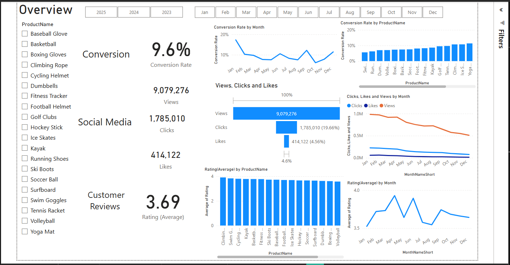
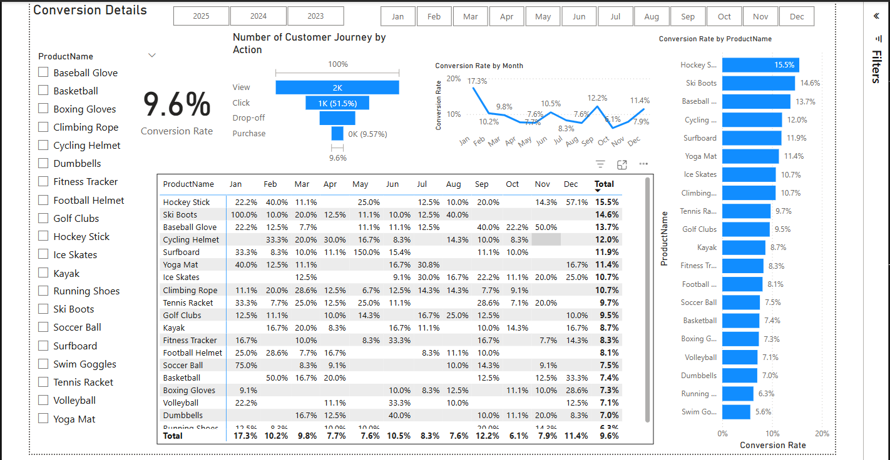
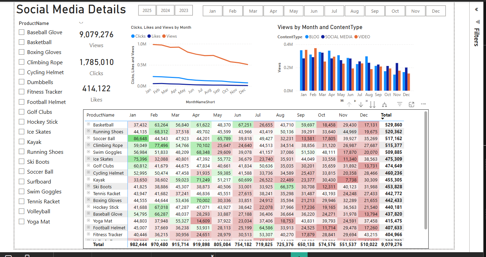
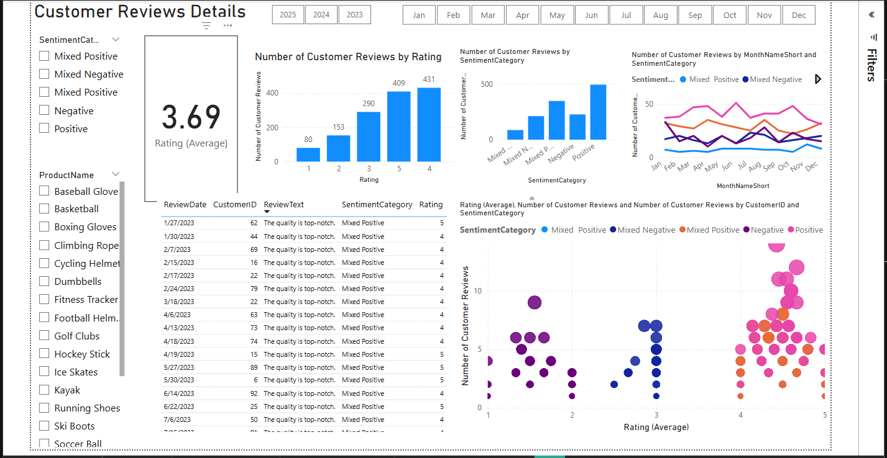

# Marketing Analytics & Customer Journey Optimization

## 1. Project Overview

This project focuses on comprehensive marketing performance analysis and customer journey optimization for ShopEasy, an e-commerce retail business. The analysis addresses declining customer engagement and conversion rates by building interactive Power BI dashboards that provide actionable insights for marketing strategy improvement and business optimization.

---

## 2. Problem Statement

ShopEasy, an online retail business, was facing significant challenges with their marketing performance:

**Key Business Challenges:**
* **Reduced Customer Engagement:** Declining customer interactions with marketing content and website
* **Decreased Conversion Rates:** Fewer website visitors converting into paying customers  
* **High Marketing Expenses:** Significant marketing investments not yielding expected returns
* **Need for Customer Feedback Analysis:** Understanding customer sentiment to improve engagement and conversions

**Objectives:**
* Analyze conversion funnel and identify drop-off points
* Evaluate social media and content marketing effectiveness
* Conduct comprehensive customer sentiment analysis
* Provide actionable recommendations for marketing optimization

---

## 3. Data Source

The analysis utilized multiple data sources from ShopEasy's digital platforms:
* **E-commerce transaction data** - Customer purchases and conversion tracking
* **Social media engagement data** - Views, clicks, likes across different content types
* **Customer review data** - Product ratings and sentiment feedback
* **Marketing campaign data** - Multi-channel performance metrics

---

## 4. Tools Used

* **Power BI Desktop:** Primary tool for data modeling, analysis, and interactive dashboard creation
* **DAX (Data Analysis Expressions):** Advanced calculations and KPI development
* **Power Query:** Data transformation and preparation
* **Data Visualization:** Interactive charts, KPI cards, and performance tracking

---

## 5. Analysis & Key Insights

### 5.1 Key Performance Indicators (KPIs):

**Overall Performance Metrics:**
* **Conversion Rate:** 9.6% overall conversion rate across all products
* **Total Views:** 9,079,276 views generated across all marketing channels
* **Social Media Engagement:** 1,785,010 clicks with 414,122 likes
* **Customer Satisfaction:** 3.69 average rating from customer reviews

### 5.2 Dashboard Insights:

**Conversion Analysis:**
* **Customer Journey Funnel:** Identified clear progression from View → Click → Drop-off → Purchase
* **Product Performance Leaders:** Hockey Stick (15.5% conversion), Ski Boots (14.6% conversion)
* **Seasonal Trends:** Peak conversion rates observed in February (17.3%) and March (10.5%)
* **Optimization Opportunities:** Significant drop-off rates identified for targeted improvement

**Social Media & Content Performance:**
* **Content Type Analysis:** Video content showing strong engagement compared to blog and social media posts
* **Monthly Trends:** Declining engagement pattern identified from January to December
* **Product-Specific Insights:** Baseball Glove leading in total views, while running shoes showing consistent performance

**Customer Sentiment Analysis:**
* **Review Distribution:** Majority of reviews (431) rated 4-5 stars, indicating positive customer sentiment
* **Sentiment Categories:** Mixed Positive leading overall feedback trends
* **Product Satisfaction:** Consistent 3.69 average rating across product categories
* **Feedback Patterns:** Positive correlation between higher ratings and conversion rates

---

## 6. Dashboard & Visualizations

The project includes four comprehensive Power BI dashboard pages:

### **Overview Dashboard**

*Comprehensive view of key performance indicators including conversion rates, social media metrics, and customer review summaries*

### **Conversion Details**

*Detailed customer journey funnel analysis showing conversion rates by product and monthly performance trends*

### **Social Media Analytics**

*In-depth analysis of social media engagement including views, clicks, likes, and content type performance across all products*

### **Customer Reviews Analysis**

*Comprehensive sentiment analysis with review distribution, rating patterns, and customer feedback trends over time*

---

## 7. Conclusion & Recommendations

The analysis provides actionable insights for ShopEasy's marketing optimization strategy:

**Key Recommendations:**

**Conversion Optimization:**
* **Focus on High-Performing Products:** Leverage success strategies from Hockey Stick and Ski Boots for other products
* **Seasonal Campaign Timing:** Increase marketing investment during February-March peak conversion periods
* **Funnel Optimization:** Address identified drop-off points in customer journey to improve overall conversion rates

**Content Strategy Enhancement:**
* **Video Content Priority:** Increase video content production based on superior engagement performance
* **Product-Specific Campaigns:** Develop targeted campaigns for high-view products like Baseball Glove
* **Engagement Recovery:** Implement strategies to reverse declining monthly engagement trends

**Customer Experience Improvement:**
* **Maintain Positive Sentiment:** Continue strategies that maintain the 3.69 average rating
* **Review Response Strategy:** Develop systematic approach to address negative feedback
* **Rating-Conversion Correlation:** Leverage positive reviews to drive higher conversion rates

**Marketing ROI Optimization:**
* **Channel Performance Focus:** Allocate budget toward highest-performing content types and products
* **Seasonal Budget Planning:** Adjust marketing spend based on identified seasonal conversion patterns
* **Customer Feedback Integration:** Use sentiment analysis insights to improve product positioning and marketing messages

---

## 8. Future Work

* **Advanced Customer Segmentation:** Develop detailed customer personas based on behavior patterns
* **Predictive Analytics:** Implement forecasting models for conversion rates and engagement trends
* **A/B Testing Framework:** Establish systematic testing for marketing campaign optimization
* **Real-time Monitoring:** Create automated alerts for KPI performance tracking
* **Cross-Channel Attribution:** Develop comprehensive view of customer touchpoint effectiveness

