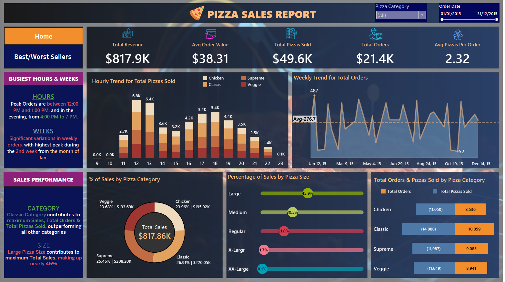
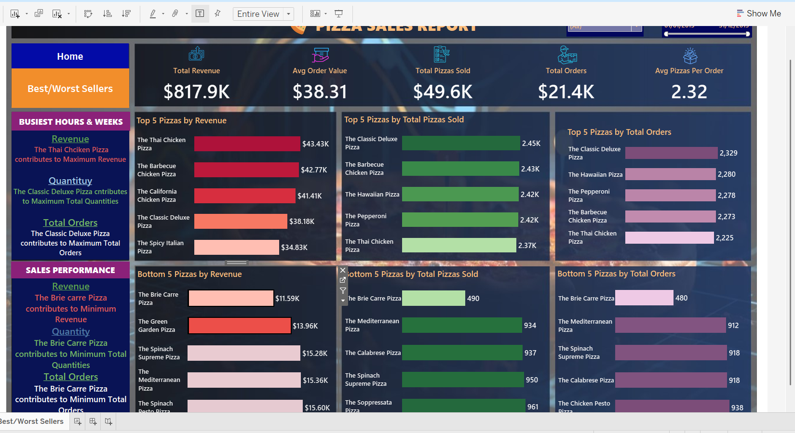

# Pizza Sales Analytics Project

## 1. Project Overview

This project focuses on analyzing pizza sales data to extract key business insights and visualize sales trends. The goal is to provide a comprehensive understanding of sales performance, identify popular items, and uncover opportunities for business improvement.

---

## 2. Problem Statement

The primary objective was to analyze key indicators for our pizza sales data to gain insights into business performance. Specifically, we aimed to calculate the following metrics and visualize various aspects of the data:

**Key Performance Indicators (KPIs):**
* **Total Revenue:** The sum of the total price of all pizza orders.
* **Average Order Value:** The average amount spent per order, calculated by dividing the total revenue by the total number of orders.
* **Total Pizzas Sold:** The sum of the quantities of all pizzas sold.
* **Total Orders:** The total number of orders placed.
* **Average Pizzas Per Order:** The average number of pizzas sold per order, calculated by dividing the total number of pizzas sold by the total number of orders.

**Visualization Requirements:**
* **Hourly Trend for Total Pizzas Sold:** Stacked bar chart displaying hourly trend of total orders.
* **Weekly Trend for Total Orders:** Line chart illustrating the weekly trend of total orders throughout the year.
* **Percentage of Sales by Pizza Category:** Pie chart showing sales distribution across different pizza categories.
* **Percentage of Sales by Pizza Size:** Pie chart representing sales attributed to different pizza sizes.
* **Total Pizzas Sold by Pizza Category:** Funnel chart presenting the total number of pizzas sold for each pizza category.
* **Top 5 Best Sellers (Revenue, Quantity, Orders):** Bar chart highlighting top 5 best-selling pizzas.
* **Bottom 5 Worst Sellers (Revenue, Quantity, Orders):** Bar chart showcasing bottom 5 worst-selling pizzas.

---

## 3. Data Source

The dataset used for this analysis contains historical pizza sales transactions, including order details, pizza types, quantities, and prices. This data was provided as part of a case study aimed at improving business performance through data-driven insights.

---

## 4. Tools Used

* **SQL (Microsoft SQL Server):** Used for data extraction, cleaning, transformation, and calculating key metrics from the raw sales data. SQL queries were fundamental for preparing the dataset for visualization and deriving the KPIs.
* **Tableau Public:** Utilized for creating interactive dashboards and visualizing the analyzed data to present insights effectively and communicate findings clearly.

---

## 5. Analysis & Key Insights

### 5.1 Key Performance Indicator (KPI) Insights:

Based on the analysis of the pizza sales data, the following key performance indicators were identified:

* **Total Revenue:** Our pizza sales generated a total revenue of **$817.9K**.
* **Average Order Value:** On average, customers spent **$38.31** per order.
* **Total Pizzas Sold:** A total of **49.6K** pizzas were sold during the analyzed period.
* **Total Orders:** We processed **21.4K** unique orders.
* **Average Pizzas Per Order:** On average, each order contained **2.32** pizzas.

### 5.2 Visualization Insights:

The interactive dashboards provided deeper insights into various sales trends and patterns:

* **Hourly Trend for Total Pizzas Sold:**
    The analysis of hourly sales shows distinct peak periods. Orders surge between **12:00 PM and 1:00 PM (lunch rush)** and again from **4:00 PM to 7:00 PM (evening/dinner rush)**. This insight is crucial for optimizing staffing and resource allocation during these high-demand times.

* **Weekly Trend for Total Orders:**
    There are notable fluctuations in total orders throughout the year. A significant peak in order activity is observed during the **second week of January**. This could suggest seasonal factors, holiday impacts, or specific marketing campaigns that drove sales during that period.

* **Percentage of Sales by Pizza Category:**
    The **Classic category** is the leading revenue generator, contributing **26.91% ($193.69K)** of total sales. The **Supreme category** closely follows with **25.46% ($208.20K)**. Chicken and Veggie categories also make substantial contributions, indicating a diverse customer base for different pizza types.

* **Percentage of Sales by Pizza Size:**
    **Large pizzas** are by far the most preferred size, accounting for a dominant **45.9%** of all sales. Medium and Regular sizes constitute the next largest portions. This clear preference for larger sizes should inform pricing strategies and inventory management.

* **Total Pizzas Sold by Pizza Category:**
    In terms of sheer quantity, **Classic pizzas** are the most sold with **10,859 units**, followed by **Supreme** with **9,083 units**. This aligns with their high revenue contribution, reinforcing their popularity.

* **Top 5 Best Sellers:**
    * **By Revenue:** The Thai Chicken Pizza ($43.4K), The Barbecue Chicken Pizza ($42.7K), The California Pizza ($41.4K), The Classic Deluxe Pizza ($38.1K), and The Spicy Italian Pizza ($34.8K) are the top revenue generators.
    * **By Quantity:** The Classic Deluxe Pizza (2.45K), The Barbecue Chicken Pizza (2.43K), The Hawaiian Pizza (2.42K), The Pepperoni Pizza (2.42K), and The Thai Chicken Pizza (2.37K) are the most frequently sold.
    * **By Orders:** The Classic Deluxe Pizza (2,329), The Barbecue Chicken Pizza (2,280), The Hawaiian Pizza (2,278), The Pepperoni Pizza (2,273), and The Thai Chicken Pizza (2,225) also lead in total orders. The **Classic Deluxe Pizza** consistently appears as a top performer across all three metrics.

* **Bottom 5 Worst Sellers:**
    * **By Revenue:** The Brie Carre Pizza ($11.59K), The Green Garden Pizza ($13.96K), The Spinach Supreme Pizza ($15.28K), The Mediterranean Pizza ($15.36K), and The Spinach Pizza ($15.60K) are the lowest contributors to revenue.
    * **By Quantity:** The Brie Carre Pizza (490 units) is a significant outlier at the bottom, followed by The Mediterranean Pizza (934), The Calabrese Pizza (937), The Spinach Supreme Pizza (950), and The Soppressata Pizza (961).
    * **By Orders:** The Brie Carre Pizza (480), The Mediterranean Pizza (912), The Spinach Supreme Pizza (918), The Calabrese Pizza (918), and The Chicken Pesto Pizza (938) received the fewest orders. The **Brie Carre Pizza** is a clear underperformer across all metrics and warrants further investigation.

---

## 6. Dashboard & Visualizations

You can view the interactive Tableau Public dashboard for this project here:

* **[Pizza Sales Analytics Dashboard on Tableau Public](https://public.tableau.com/app/profile/osama.audi/viz/Pizza_Sales_Analytics/Home)**

*A comprehensive view of key performance indicators, hourly and weekly sales trends, and sales distribution by category and size.*

*Detailed analysis showcasing the top and bottom performing pizzas across revenue, quantity, and total orders.*

---

## 7. Conclusion & Recommendations

The analysis provides actionable insights into the pizza sales business performance. By understanding customer preferences and sales trends, strategic decisions can be made to optimize operations and boost revenue.

**Key Recommendations:**
* **Optimize Staffing and Operations:** Align staff schedules and kitchen capacity with the identified peak hours (12-1 PM, 4-7 PM) to ensure efficient service and customer satisfaction during busy periods.
* **Leverage Popular Products:** Continue to promote and ensure consistent availability of top-selling pizzas, especially the Classic Deluxe, as they are significant revenue and order drivers.
* **Strategize on Underperformers:** Investigate the reasons behind the low sales of pizzas like the Brie Carre. This could involve reviewing its ingredients, pricing, marketing, or considering menu adjustments if it continues to underperform.
* **Capitalize on Pizza Size Preference:** Given the strong preference for large pizzas, consider exclusive promotions or bundled deals focusing on this size to maximize average order value.
* **Explore Weekly Trend Drivers:** Further analyze the factors contributing to the peak in the second week of January to potentially replicate success in other periods of the year.

---

## 8. Future Work

* **Customer Segmentation:** Analyze customer demographics or purchase history to identify distinct customer groups and tailor marketing campaigns.
* **Promotional Effectiveness:** Study the impact of past promotions and discounts on sales to optimize future marketing efforts.
* **Supply Chain Optimization:** Use sales data to forecast ingredient needs more accurately, reducing waste and improving freshness.

