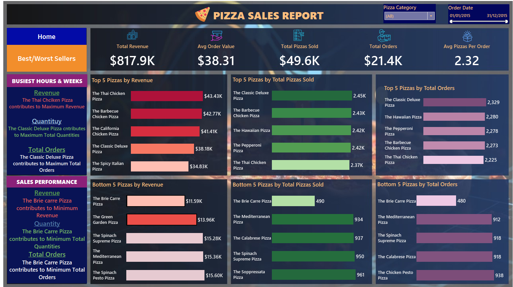

# 🍕 Pizza Sales Analytics Dashboard

## 📊 Project Overview

This project explores pizza sales performance using SQL for data analysis and Tableau for dashboard visualization. The goal is to uncover key business insights, optimize product performance, and inform strategic decisions.

---

## 🎯 Objectives

- Analyze historical pizza sales data to extract actionable insights
- Build interactive dashboards highlighting key trends
- Identify top and bottom-performing products
- Recommend data-driven improvements for operations and marketing

---

## 🧮 Key Metrics (KPIs)

- **Total Revenue:** $817.9K  
- **Average Order Value:** $38.31  
- **Total Pizzas Sold:** 49.6K  
- **Total Orders:** 21.4K  
- **Avg. Pizzas per Order:** 2.32

---

## 📈 Visual Insights

- **Peak Hours:** 12–1 PM & 4–7 PM  
- **Top Categories:** Classic and Supreme pizzas  
- **Size Preference:** Large pizzas dominate (46% of sales)  
- **Top Performers:** Classic Deluxe, Thai Chicken, BBQ Chicken  
- **Underperformers:** Brie Carre and Spinach Supreme

---

## 🔧 Tools Used

- **SQL (Microsoft SQL Server):** Data cleaning, aggregation, KPI calculations  
- **Tableau Public:** Dashboards and trend visualizations

---

## 📊 Dashboard Preview

🔗 **[View Live Dashboard on Tableau Public »](https://public.tableau.com/app/profile/osama.audi/viz/Pizza_Sales_Analytics/Home)**

*Sales KPIs, hourly/weekly trends, and category distribution*

*Top and bottom 5 pizzas by revenue, quantity, and orders*

---

## ✅ Recommendations

- **Optimize peak-hour operations** for lunch and dinner rush  
- **Promote best-sellers** like Classic Deluxe across campaigns  
- **Review underperformers** (e.g., Brie Carre) for potential menu adjustments  
- **Focus promotions on large sizes**, aligning with customer preference  
- **Explore seasonal patterns** (e.g., 2nd week of January sales spike)

---

## 🚀 Future Enhancements

- Customer segmentation for personalized offers  
- Promotion effectiveness analysis  
- Ingredient-level forecasting to reduce waste

---

